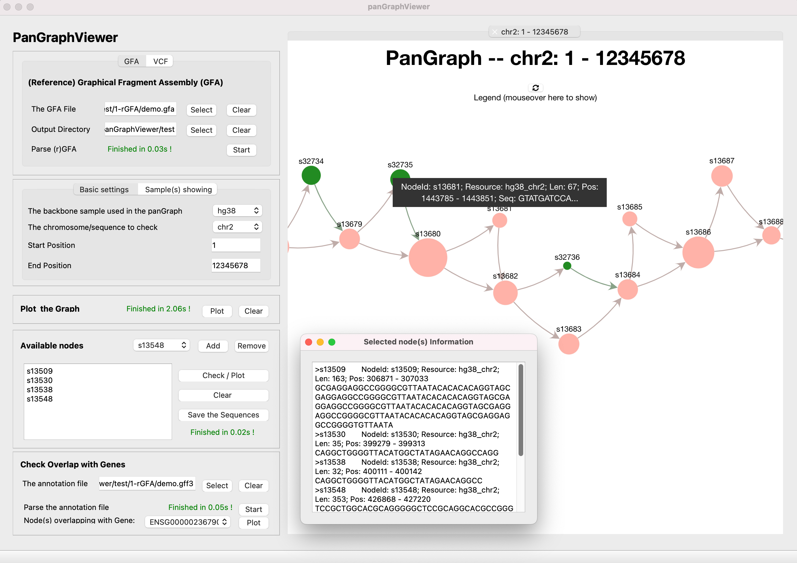

# PanGraphViewer -- show panenome graph in an easy way

    

### Table of Contents


- [Versions and dependences](#versions-and-dependences)
  - [Desktop-based panGraphViewer](#desktop-based-pangraphviewer)
    - [Library installation for the desktop-based version](#library-installation-for-the-desktop-based-version)
    - [Start the desktop-based version](#start-the-desktop-based-version)
  - [Web-based panGraphViewer](#web-based-pangraphviewer)
    - [Library installation for the web-based version](#library-installation-for-the-web-based-version)
    - [Start the web-based version](#start-the-web-based-version)
- [The Files needed in the application](#the-files-needed-in-the-application)
  - [The rGFA file](#the-rgfa-file)
  - [The VCF file](#the-vcf-file)
  - [The BED file](#the-bed-file)
- [Q&A:](#qa)
  - [The minimum computing resource needed](#the-minimum-computing-resource-needed)
  - [Which application should I use](#which-application-should-i-use)
  - [The backbone sample](#the-backbone-sample)
  - [The colors showed in the graph](#the-colors-showed-in-the-graph)
  - [The type of graphs](#the-type-of-graphs) 
  - [The shapes showed in the graph](#the-shapes-showed-in-the-graph)
  - [How to use the program](#how-to-use-the-program)
  - [Different variations](#different-variations)

---
## Versions and dependences
Here we provide **two** application versions:
```
● Desktop-based application
● Web browser-based application
```
Overall, **Python3** is needed to run this software and we highly recommend using ``miniconda3`` to install all ``python3`` libraries.
```
● On Windows system, you can download miniconda3 at 
  https://repo.anaconda.com/miniconda/Miniconda3-latest-Windows-x86_64.exe

● On macOS system, you can download miniconda3 at 
  https://repo.anaconda.com/miniconda/Miniconda3-latest-MacOSX-x86_64.sh  

● On Linux system,  you can download miniconda3 at 
  https://repo.anaconda.com/miniconda/Miniconda3-latest-Linux-x86_64.sh
```

After the installation of ``miniconda3``, you can follow the steps below to ensure `panGraphViewer` can be executed.

---
### Desktop-based panGraphViewer

#### Library installation for the desktop-based version

Steps on different systems

* If you use ``Windows`` system, you may need to find or search ``Anaconda Powershell Prompt (miniconda3)`` first and then open it.

* If you use ``macOS`` or ``Linux`` system, you may open ``Terminal`` first and then type the command line below
    ```
    $ export PATH=/full/path/to/miniconda3/bin:$PATH # modify the path based on your ENV
    ```

After the steps above, you can install the ``python3`` libraries by typing:

```
conda config --add channels conda-forge
conda config --add channels bioconda
conda install pyqt pyqtwebengine configparser pandas bokeh==2.2.3 dna_features_viewer natsort attrdict networkx 
```

If you use ``pip``, you can install the ``python3`` libraries like:
```
pip install PyQt5 PyQtWebEngine configparser pandas bokeh==2.2.3 dna_features_viewer natsort attrdict networkx
```

or you can use ``pip`` to install like (need to go to the ``panGraphViewerApp`` directory first)

```
pip install -r requirement.txt ## On Linux or macOS system
pip install -r requirement_windows.txt ## On Windows system
```


**Note:** 

1. On ``Linux`` or ``macOS`` system, ``pysam`` is needed. You may install this package using

    ```
    $ conda install pysam 
    ```

2. On ``Windows`` platforms, as `pysam` is not available, we use a windows-version ``samtools`` package instead. Additional libraries below are needed and can be installed using

    ```
    > conda install m2-base pyfaidx
    ```

---
#### Start the desktop-based version 

1. On ``Linux`` or ``macOS`` system, you may use the command line below in ``Terminal`` to open the software.

    ```
    $ cd /full/path/to/panGraphViewer/panGraphViewerApp # modify the path based on your ENV
    $ python panGraphViewerApp.py
    ```
2. On ``Windows`` system, you may search and open ``Anaconda Prompt (miniconda3)`` first and then move to the ``panGraphViewer`` directory. For example, if you have put ``panGraphViewer`` on your ``Desktop`` and the opened ``Anaconda Prompt (miniconda3)`` is in your ``C`` drive, you may use the command line below to start the program:

    ```
    > cd C:\Users\%USERNAME%\Desktop\panGraphViewer\panGraphViewerApp
    > python panGraphViewerApp.py
    ```

    If you have put ``panGraphViewer`` on other drive, you may need to move to the target drive first. For instance, the target drive is ``D``, you can move to the drive by typing **D:** in ``Anaconda Prompt (miniconda3)`` and then move to the ``panGraphViewer`` directory to execute ``panGraphViewerApp.py``.

    Please **NOTE** that on ``Windows`` system, you need to use backslash ``\ `` rather than the common slash ``/`` to move to the target directory.

3. The logging information will show in ``Anaconda Prompt (miniconda3)`` or ``Terminal`` depending on the system you use (Will be good for you to monitor the status of the application). 

---
### Web-based panGraphViewer

To meet different requirments, we have also created a ``web-based panGraphViewer``. Basically, most functions provided in the ``Desktop-based`` version have been implemented in the ``Web browser-based`` version. Users can install this version locally or directly deploy this online. The ``web browser-based`` verison offers administrative functions to help create accounts for different users. 

#### Library installation for the web-based version
Depending on the systems used, users can use ``pip`` directly to install the needed ``python3`` libraries after moving to the ``panGraphViewerWeb`` directory.

```
pip install -r requirement.txt ## On Linux or macOS system
pip install -r requirement_windows.txt ## On Windows system
```
As mentioned in the ``desktop-based`` version, ``pysam`` cannot be installed on ``Windows`` systems, users need to install alternatives on ``Windows`` by using
```
> conda install m2-base pyfaidx
```
For ``Linux`` or ``macOS`` users, ``pysam`` can be installed directly using 
```
$ conda install pysam
```
---
#### Start the web-based version
After the installation above, users can move to the ``panGraphViewerWeb`` directory by referring to the steps mentioned in the ``desktop`` version through ``Terminal`` or ``Anaconda Prompt (miniconda3)``. 

**Note** that the folder needed here is **panGraphViewerWeb**.

Once moving to the ``panGraphViewerWeb`` directory, users can start the application by typing 
```
python manage.py runserver <IPaddress>  ## on local machine the IPaddress can be: localhost:8004
```

or users can use the ``CMD`` below to start the ``Web browser-based`` version 
```
$ bash run.sh   ## On linux or macOS system.
> run.bat ## On Windows system
```

**Note**: the IP 0.0.0.0 in ``run.sh`` can be modified accordingly

Once the words ``Starting development server at http://localhost:8004/`` or similar infomation is shown, user can open a browser to open the ``web-based panGraphViewer``.

The admin page is ``http://localhost:8004/admin`` and the inital admin info is:
```
Account: admin
password: abcd1234
```

**Note:** please use the **go back** button provided by the web browser to **move back** rather than directly clicking the corresponding functions in the web page to perform analyses.

---

### The Files needed in the application

#### The rGFA file 

1. If you have multiple high-quality genome assemblies from different individuals, you may use [minigraph](https://github.com/lh3/minigraph) (``Linux`` preferred) to generate a reference GFA (``rGFA``) file.

    Before the running, the header of the fasta file needs modifying. For example, if you have a fasta file from **Sample1** with a header like:
    ```
    >chr1
    AAAAAGCCGCGCGCGCTTGCGC
    ```

    You may modify the header to:
    ```
    >Sample1||chr1
    AAAAAGCCGCGCGCGCTTGCGC
    ```
    On ``Linux``, the command lines that can be used to achieve this are:
    ```
    $ sample="" ## the name of the sample. For instance: Sample1
    $ fasta="" ## full path to the fasta file
    $ name=`echo $fasta | rev | cut -d"." -f2-| rev`
    $ sed -e "s/>/>${sample}||/g" $fasta > ${name}.headerModified.fasta
    ```

    We also provide a python script ``renameFastaHeader.py`` to help this conversion. The script can be found in the ``scripts`` folder under ``panGraphViewer`` --> ``panGraphViewerApp``. Or users can use the UI to convert by clicking ``Tools`` --> ``Format Conversion`` --> ``Modify FASTA Header``.

    ```
    usage: renameFastaHeader.py [-h] [--version] [-f FASTA] [-n NAME] [-o OUTPUT]

    rename the header of a given fasta file

    optional arguments:
      -h, --help  show this help message and exit
      --version   show program's version number and exit
      -f FASTA    a fasta format file
      -n NAME     name of the sample
      -d DELIM    delimiter. Default: '||'
      -o OUTPUT   the output directory
    ```

    Please **NOTE** that:

    I). If you do not modify the header of your fasta file and directly use ``minigraph`` to generate the ``rGFA`` file, ``panGraphViewer`` can still read the file, while many features, such as ``where the node comes from`` would not show in detail. A warning message will display in both UI and the opened ``Terminal`` or ``powershell``.

    II). For the sample name, please ``DO NOT`` include ``||``.

2. If you don't have an ``rGFA`` file, but a ``GFA`` file, you may try to follow the standard [here](https://github.com/lh3/gfatools/blob/master/doc/rGFA.md) to convert your ``GFA`` file into an ``rGFA`` file. After generating an ``rGFA`` file, you can use this software to visualise the graph of interest. 
---

#### The VCF file

We also accept a ``VCF`` file to show the graph. Basically, a reference FASTA file is **optional** if the ``VCF`` is a standard one. The program will automatically check the input ``VCF`` file and evaluate if the ``VCF`` file meets the requirement. If not, a message will show.

``VCF`` **filtration** is highly recommended before plot the graph. 

We also provide a method to help convert a ``VCF`` file to an ``rGFA`` file. Users can perform the conversion directly through the interface provided in the application or directly use ``vcf2rGFA.py`` under the ``panGraphViewer`` --> ``panGraphViewerApp`` --> ``scripts`` folder. 

**Note:** If there are **many** variations in the ``VCF`` file, we recommend using ``vcf2rGFA.py`` directly to convert by chromosomes rather than converting entirely. This will save a lot of computing resource when plot graphs.

The usage of ``vcf2rGFA.py`` is shown below. Both ``Windows`` and ``Linux/macOS`` users can directly use this script to convert a ``VCF`` file to an ``rGFA`` file. 
```
usage: vcf2rGFA.py [-h] [--version] [-f FASTA] [-b BACKBONE] [-v VCF] [-o OUTPUT] [-c [CHR [CHR ...]]] [-n NTHREAD]
    
Convert a vcf file to an rGFA file
    
optional arguments:
    -h, --help          show this help message and exit
    --version           show program's version number and exit
    -f FASTA            a fasta format file that from the backbone sample
    -b BACKBONE         the name of the backbone sample
    -v VCF              the vcf file
    -o OUTPUT           the output directory
    -c [CHR [CHR ...]]  the name of the chromosome(s) [default: all chroms]
    -n NTHREAD          number of threads [default: 4]
```
---

#### The BED file 

Basically, the ``BED`` file should contain the annoation information from the ``backbone`` sample. There should be at least 6 columns in the ``BED`` file.

| Column  | Information                                                           |
| :-----: | :---------------------------------------------------------------------|
| 1       | Chromosome ID                                                         |
| 2       | Gene start position                                                   |
| 3       | Gene end position                                                     |
| 4       | Gene ID                                                               |
| 5       | Score (or others; the program does not use the info in this column)   |
| 6       | Orientation                                                           |

Users can load the ``BED`` file to check the overlaps between variations and genes. By default, genes overlapping with more than ``2`` nodes will be shown in the dropdown menu. A gene list will be saved in the output directory after parsing the ``BED`` file.

---

### Q&A:

#### The minimum computing resource needed

The minimum computing resource needed for running the application
```
Memory:  1Gb
Threads: 2
```
---

#### Which application should I use

For the ``desktop-based`` application, it is optimized on ``Windows 10`` and ``macOS Big Sur``. ``Ubuntu 18.04.5`` is also tested. For ``Linux`` operating system version below ``Ubuntu 18.04.5`` or equivalent, such as ``Ubuntu 16.04``, ``PyQtWebEngine`` may not work properly. For other versions of operating systems, the ``desktop-based`` application may still work, however, the **layout** of the application may differ.

For the ``web browser-based`` version, we suggest running in ``Linux`` or ``macOS`` environment. If users want to run on ``Windows`` systems, ``Windows 10`` or above is recommended. Users can also use ``docker`` to run the ``web browser-based`` version. However, ``WSL`` is needed to run the docker version on ``Windows 10`` or above.

---

#### The backbone sample

The ``backbone`` sample is the one used as the **main sequence provider** to produce the pangenome graph or the reference sample to produce the ``VCF`` file. In the pangenome graph, most of the nodes are from the ``backbone`` sample (shared by all) with some nodes (variations) from other samples. 

---
#### The colors showed in the graph

Each sample uses one particular colour and **the most frequent colour** should be the one used for the ``backbone`` sample. The colours are randomly selected by the program from a desgined colour palletes.

---
#### The type of graphs 

We provides two kinds of graph plots in the program to achieve a good performance and visualisation. By default, if the number of checked nodes <= **200**, ``vis.js`` based graph will show. Otherwise, a ``cytoscape.js`` based graph will show. Users can change the settings in the ``desktop-based`` application.

---
#### The shapes showed in the graph

If you use a ``VCF`` file to show graphs, we use different nodes shapes to represent different kinds of variants. For instance, in the default settings for the ``vis.js`` based graph, ``dot`` represent ``SNP``, ``triangle`` represents ``deletion``, ``triangleDown`` reprsents ``insertion``, ``database`` represents ``duplication``, ``text`` shows ``inversion`` and ``star`` represent ``translocation``. Users can change the corresponding settings to select preferred node shapes to represent different variations on the ``desktop-based`` application.

---
#### How to use the program

For more detailed steps to run ``panGrapViewer``, please refer to the [Manual](doc/Manual.md)

---
#### Different variations 

If users use a ``VCF`` file to generate a graph genome, when moving the mouse to the graph node, the program will automatically show the variation types, such as ``SNP``(single nucleotide polymorphism), ``INS`` (insertion), ``INV`` (inversion) and ``DUP`` (duplication). The corresponding nodes from the ``backbone`` sample will also be linked and shown. 

---
Enjoy using panGraphViewer!
