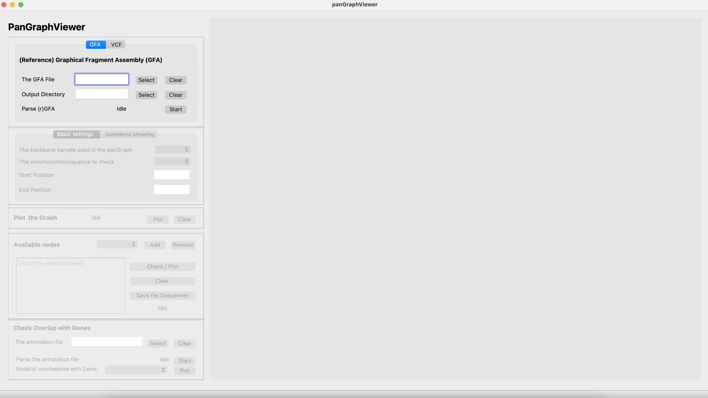

<h1 align="center">Manual for PanGraphViewer</h1>
  
<h3 align="center">Yuxuan Yuan, Ricky Ma and Ting-Fung Chan*</h3>
<h5 align="center">The Chinese University of Hong Kong, Hong Kong</h5>

  

  
<h4 align="center">Version 1.0.2</h4>
<h4 align="center"> 2022-09-01</h4>

# Table of Contents

- [Workflow for using PanGraphViewer](#workflow-for-using-pangraphviewer)
  - [Plot a genome graph](#plot-a-genome-graph)
  - [Check the sequence of nodes of interest](#check-the-sequence-of-nodes-of-interest)
  - [Show gene models that may be interrupted by some sequences/nodes in some samples](#show-gene-models-that-may-be-interrupted-by-some-sequencesnodes-in-some-samples)
- [How to use desktop-based PanGraphViewer](#how-to-use-desktop-based-pangraphviewer)
  - [Load Files for Graph Visualization](#load-files-for-graph-visualization)
    - [GFA](#gfa)
    - [VCF](#vcf)
  - [Selection for Plot](#selection-for-plot)
  - [Genome Graph](#genome-graph)
  - [Check node information](#check-node-information)
  - [Display gene models that may be interrupted in some samples](#display-gene-models-that-may-be-interrupted-in-some-samples)
- [How to use web browser-based PanGraphViewer](#how-to-use-web-browser-based-pangraphviewer)

## Workflow for using PanGraphViewer

Thank you for choosing PanGraphViewer. Hope you can find our tool is useful for your study. In this section, we will introduce a general ``workflow`` (see the figure below) that can be used to explore ``PanGraphViewer``.

  

There are three key functions that we would like to emphasize.
* Plot a genome graph 
* Check the sequence of nodes of interest
* Show gene models that may be interrupted by some sequences/nodes in some samples

### Plot a genome graph
Depending on the purpose and preference, users can install either application on their platform.

* Before starting the application, firstly, users need to prepare an ``rGFA`` file, a ``GFA_v1`` file or a ``VCF`` file that can be directly imported into the application. An output directory is also needed when processing the analyses. 

* After specifying a needed file and an output directory, users can start to parse the file and then the graph information underlying would be stored in the memory. Users can adjust their purpose to decide which chromosome/sequence or a segment of it can be displayed in the display canvas by specifying the ``backbone``, ``chromosome/sequence`` name, ``coordinates`` or "nodeIDs".. 

* Once the graph is displayed, users can use, for example, the ``mouse`` to zoom in and out to explore the graph. Hover information will show in the canvas if users move the ``mouse`` to the node.

### Check the sequence of nodes of interest
If users find some nodes are of interest, they can check or save the sequence of the nodes.

* Usually, users can check nodes that are in variant hotspot regions or nodes falling in the gene model regions which may interrupt the genes and change the functions in some samples.

* The saved node sequences can also be imported to other tools such as ``NCBI BLAST`` to check the functions.

### Show gene models that may be interrupted by some sequences/nodes in some samples
If users have the annotation file for the ``backbone`` sample, they can check gene models that are interrupted by some sequences/nodes in some samples. 

* This would be of particular interest to biologists to find out if some important gene models are interrupted by some insertions, deletions, duplications or inversions in some samples.

## How to use desktop-based PanGraphViewer

For the ``desktop-based`` application, once it is opened as shown below, users can follow the following steps to explore the program.

  

### Load Files for Graph Visualization
Here we provide two options to let users select if they want to explore a ``GFA``-based graph or a ``VCF``-based graph.

#### GFA
When selecting to plot a ``GFA``-based graph, an ``rGFA`` file or a ``GFA_v1`` file is needed. Users can click the ``Select`` button to specify the file and then select an output directory to perform the analyses.

  

#### VCF
When selecting to plot a ``VCF``-based graph, a ``VCF`` file is needed. 

  

Users can click the ``Select`` button to specify the VCF file. An output directory is also needed to perform the analyses. Here the ``Backbone name`` and ``Backbone fasta`` are optional if 
* the VCF file is a standard one with sequence/contig header and length clearly documented and users do not have a ``backbone fasta`` 
* users have a standard VCF file but have no interest in node sequences 

The program will check automatically if the given ``VCF`` file is a standard one once a ``fasta`` file is not specified. If the ``VCF`` file selected is not qualified, an error message will pop up.

  

Otherwise, a warning message will show.

  

By default the ``Backbone name`` is **backbone** and the ``Threads`` to parse the VCF file is ``4``.   

Once the files are selected and the output directory is specified, users can click the ``Start`` button to parse either the given ``GFA`` file or the ``VCF`` file. The program will run internally with 'Parsing... or Converting ...'  showing in the ``Status`` bar. Once this is completed, 'Finished in xxx s!' will show. 

### Selection for Plot
After completing ``GFA`` or ``VCF`` parsing, users can go to the ``Selection for Plot`` panel to check genome graphs. Here we provide ``Basic settings`` and ``Sample(s) showing`` panels to let users customize their plots. 

In the ``Basic settings`` panel, users can select a particular ``chromosome/sequence`` to display after specifying the name of the ``backbone`` sample.

  

For the ``start`` and ``end`` positions, users can specify both of them, one of them or none. For example, 
* if users specify both ``start`` and ``end`` positions, the graph will be limited to the two positions within the selected chromosome/sequence. 
* if only ``start`` position is given, the program will display a graph between the ``start`` position and the end position of the selected chromosome/sequence. 
* if only ``end`` position is given, the program will display a graph between 1 to the given ``end`` position within the selected chromosome/sequence. 
* if both start and end positions are not given, the program will display the entire graph of the selected chromosome/sequence.

Additionally, the program will check if the given ``start`` and ``end`` positions are qualified automatically. If not, a warning message will pop up and the plot will not be generated.

For the ``Sample(s) showing`` panel, users can select to hide nodes from particular sample(s) if they have such a demand.

  

### Genome Graph
After completing the settings above, users can either click the ``Plot`` button in the ``Plot the Graph`` panel to generate the graph or customise the ``Settings`` first and then plot graphs. 

In ``Settings``, users can select ``Node Shapes`` to specify node shapes in either ``vis.js``-based plot or ``cytoscape.js``-based plot from the dropdown menus.

  

Users can also select to use either ``vis.js`` or ``cytoscape.js`` to plot graphs by the number of nodes specified in the ``Graph Modification`` panel under ``Settings``. 

  

By default, if users want to check graphs with <=200 nodes, ``vis.js`` will be applied to generate graphs. Users can adjust this value (``200``) depending on their preference. However, if there are over ``five thousands`` of nodes that users want to browse in one graph, we **don't recommend** using ``vis.js`` as it may take a long time to load the graph file (an html file).

Depending on the screen/display size, users may also need to adjust the canvas ``height and width`` to make the graph fully show in the canvas if selecting ``vis.js``-based plot. The hover box may run off the screen if the canvas ``height and width`` settings do not match with users' screen size. 

Once all settings are ready, users can click the ``Plot`` button to generate the graphs. After the graph is shown in the display canvas, users can use the ``mouse`` to zoom in and out to check graph details. Users can also move the ``mouse`` close to a specific node to check the node information (**mouseover**, see the figure below).

From the hover box, users can capture the information, such as
  
  * **NodeID**: the node identity 
  * **Resource**: the node belongs to which chromosome/sequence in which sample
  * **Len**: the sequence length of the node
  * **Pos**: the coordinate of the backbone node
  * **Info**: if the graph is from a VCF file, it will show the type of variants and the occur position in the backbone sample. ``SNP`` represents single nucleotide polymorphism, ``INS`` represents insertion, ``INV`` represents inversion,  ``DUP`` represents duplication and ``TRANS`` represents translocation.
  * **Seq**: the first 10 nucleotides of the node sequence if it has

If users decide to use ``vis.js`` to plot graphs, we also provide some options in ``Settings`` to let users customize the plot if they don't like the default one.

* **Graph Interaction**: to enable/disable some functions when interacting with the graph

  

  

* **Graph Modification**: to customise the display of the graph, for instance the ``graph layout``, ``edge length`` and the ``degree of node overlapping``.  
  

  

Users can customise the graph by enabling the options and the corresponding options would be shown in the display canvas during ``graph display``. 

While in ``cytoscape.js``-based plot, we do not provide such functions or interactions mentioned in the ``vis.js``-based plot. However, one unique interaction in ``cytoscape``-based plot is that users can press ``Ctrl`` or ``command`` and hold the ``left click`` button of the ``mouse`` to select particular node regions and then ``right`` click the ``mouse`` to show or hide nodes (see the figure below). This would be useful if users want to check a specific subgraph.

### Check node information
We provide two ways to check the node information. 
* One way is that users can move the ``mouse`` to a specific node in the display canvas and then a hover box will show the information of the node. 
  
  

  
  

* Another way is that users can check the information of nodes from the ``Available Nodes`` panel. 
  
  

    
  

  * In the dropdown menu, the first 20000 nodes in the entire graph will be listed. Users can select the node that they want to check or remove it from the selected list.
  * Users can also type the node id in the ``List of the selected node(s)`` panel by lines
  * Once clicking the ``Check/Plot`` button, the program will pop out a diag box asking if users want to browse the sequences of selected nodes or the graph built by the selected nodes. Users can decide by click the corresponding button. 
  * Users can also click the ``Save the Sequences`` button to save the ``fasta`` file to the output directory. Users can import the saved sequence file to other programs, such as ``NCBI-blast`` for downstream analyses.
  
  Please **note** that by default we only allow a sequence display with <= ``1000000`` bp in length. The reason to do this is that if a large sequence is needed to display, it would take a long time to show. Users can change the setting in ``Settings``--> ``Graph Modification`` if they really want to display a large sequence. 

### Display gene models that may be interrupted in some samples 
If users have an annotation file for the ``backbone`` sample, they can check gene models that may be interrupted by some sequences in some samples. 

  

Basically, users need to 
* specify the annotation file and then parse it. By default, gene models having at least ``2`` nodes falling in the region can be retained. Users can change this setting in ``Settings`` --> ``Graph Modification``.
* once the parsing is completed, users can select a gene model from the dropdown menu to check nodes that fall in the selected gene region.

After clicking the ``Plot`` button, a plot will show in the display canvas.  

  

* Users can enable the zoom in and out function by clicking the ``Wheel Zoom(x-axis)`` button on the right top panel in the canvas. 
* In the canvas, users can get the selected gene model ID and the nodes falling in the gene region. 
* Users can check the nodes through the ``Available Nodes`` panel or plot ``subgraphs`` using the coordinate of the gene model.

## How to use web browser-based PanGraphViewer

After the installation of the web-based PanGraphViewer, users can follow ``README`` to open it. The login interface is like:

  

Users can use the test account (``demo``) or personal account to open the application. 

After opening the page showing above, users can 

* follow similar approaches used in the ``desktop-based`` version, users can ``upload`` and ``parse`` a GFA file, an ``rGFA`` file or a ``VCF`` file to the system
* plot pangenome graph/subgraph from the ``Plot pangenome`` panel
* explore the node information from the ``Extract nodes`` panel
* check gene models that may be interrupted by some sequences in some samples

  

Notably, when selecting specific nodes in the graph, the web-based application provides options to directly check/download the node sequence(s). 

  

For the ``admin`` account, users can login using the steps shown in the ``README`` file. The interface of the login page is like: 

  

Once entering the login page, the admin can create accounts for either groups or users.

  

---
Enjoy using PanGraphViewer!
